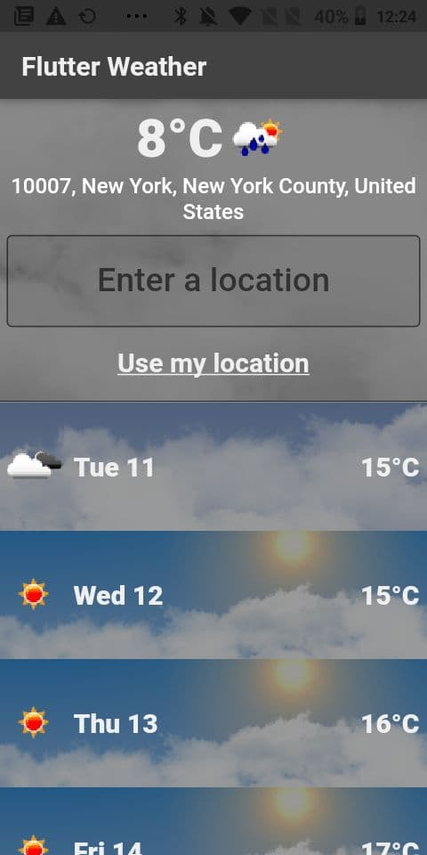

## native_wheater
Flutter app for reading weather

<p align="center">
 
</p>

## Getting started

In order to run the app, you need to follow the next steps

1. Install [Flutter SDK](https://flutter.dev/docs/get-started/install)

2. Clone and navigate to project root folder
3. Get flutter packages
```
chmod +x update.sh
./update.sh
```

4. Put you OpenWeather api key inside assets/env.json file
5. Compile & Run :)
